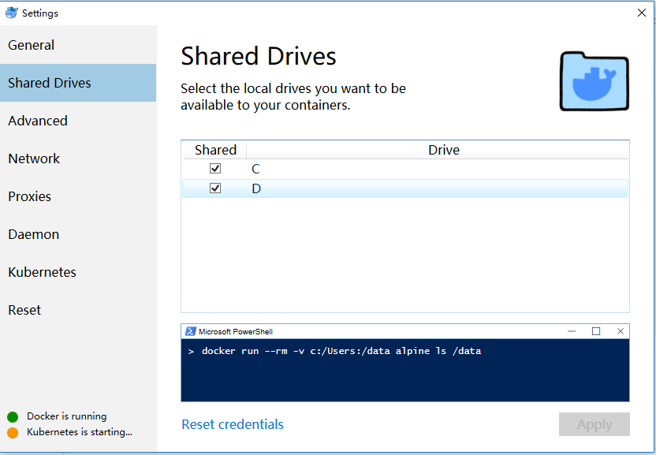
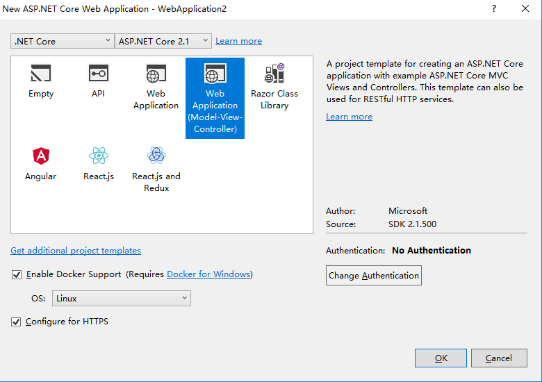

# <a name="visual-studio-tools-for-docker-with-aspnet-core"></a>使用 ASP.NET Core 的 Visual Studio Tools for Docker

使用 Visual Studio Code 和 Docker CLI 时，Visual Studio Tools for Docker 开发工作流是类似于工作流。 实际上，它基于相同的 Docker CLI，但它是更轻松地开始，可以简化此过程中，并提供了提高工作效率生成、 运行和组合任务。 执行和调试简单的操作，例如通过容器F5并Ctrl+F5。 通过可选容器业务流程支持，除了能够运行和调试单个容器，可运行和调试容器Visual Studio 2017 支持生成、调试和运行面向 .NET Core 的容器化 ASP.NET Core 应用。 Windows 和 Linux 容器均受支持。

[查看或下载示例代码](https://github.com/aspnet/Docs/tree/master/aspnetcore/host-and-deploy/docker/visual-studio-tools-for-docker/samples)（[如何下载](xref:index#how-to-download-a-sample)）

## <a name="prerequisites"></a>系统必备

* [Docker for Windows](https://docs.docker.com/docker-for-windows/install/)
* 具有“.NET Core 跨平台开发”工作负载的 [Visual Studio 2017](https://www.visualstudio.com/)

## <a name="installation-and-setup"></a>安装和设置

要安装 Docker，请先查看[用于 Windows 的 Docker：安装须知](https://docs.docker.com/docker-for-windows/install/#what-to-know-before-you-install)了解相关信息。 然后安装[用于 Windows 的 Docker](https://docs.docker.com/docker-for-windows/install/)。

Docker for Windows 中的[共享驱动器](https://docs.docker.com/docker-for-windows/#shared-drives)必须配置为支持卷映射和调试。 右键单击系统托盘中的 Docker 图标，单击“设置”，然后选择“共享驱动器”。 选择 Docker 存储文件的驱动器。 单击“应用”。



> [!TIP]
> 未配置共享驱动器时，Visual Studio 2017 15.6 及更高版本会发出提示。

## <a name="add-a-project-to-a-docker-container"></a>向 Docker 容器添加项目

若要容器化 ASP.NET Core 项目，项目必须面向 .NET Core。 同时支持 Linux 和 Windows 容器。

向项目添加 Docker 支持后，可选择 Windows 或 Linux 容器。 Docker 主机必须运行类型相同的容器。 要更改正在运行的 Docker 实例中的容器类型，请右键单击系统托盘中的 Docker 图标，再选择“切换到 Windows 容器...”或“切换到 Linux 容器...”。

### <a name="new-app"></a>新应用

使用“ASP.NET Core Web 应用”项目模板新建应用时，请选中“启用 Docker 支持”复选框：


如果目标框架是 .NET Core，可通过 OS 下拉列表选择容器类型。

### <a name="existing-app"></a>现有应用

对于面向 .NET Core 的 ASP.NET Core 项目，可通过两个选项使用工具添加 Docker 支持。 在 Visual Studio 中打开项目，然后选择以下选项之一：

* 从“项目”菜单中选择“Docker 支持”。
* 右键单击“解决方案资源管理器”中的项目，然后选择“添加” > “Docker 支持”。

Visual Studio Tools for Docker 不支持向面向.NET Framework 的现有 ASP.NET Core 项目添加 Docker。

## <a name="dockerfile-overview"></a>Dockerfile 概述

Dockerfile，用作创建最终 Docker 映像的方案，添加到项目根目录。 请参阅 [Dockerfile 引用](https://docs.docker.com/engine/reference/builder/)，了解其中的命令。 此特定 Dockerfile 使用[多阶段生成](https://docs.docker.com/engine/userguide/eng-image/multistage-build/)，该生成包含四个不同的命名生成阶段：

::: moniker range=">= aspnetcore-2.1"

[!code-dockerfile[](visual-studio-tools-for-docker/samples/2.1/HelloDockerTools/Dockerfile.original?highlight=1,6,14,17)]

前面的 Dockerfile 基于 [microsoft/dotnet](https://hub.docker.com/r/microsoft/dotnet/) 映像。 此基础映像包括 ASP.NET Core 运行时和 NuGet 包。 对该包进行了实时 (JIT) 编译，以提高启动性能。

如果选中了新建项目对话框的“为 HTTPS 配置”复选框，则 Dockerfile 公开两个端口。 一个端口用于 HTTP 流量；另一个端口用于 HTTPS。 如果未选中该复选框，则为 HTTP 流量公开单个端口 (80)。

FROM microsoft/dotnet:2.1-aspnetcore-runtime AS base
WORKDIR /app
EXPOSE 59518
EXPOSE 44364

FROM microsoft/dotnet:2.1-sdk AS build
WORKDIR /src
COPY HelloDockerTools/HelloDockerTools.csproj HelloDockerTools/
RUN dotnet restore HelloDockerTools/HelloDockerTools.csproj
COPY . .
WORKDIR /src/HelloDockerTools
RUN dotnet build HelloDockerTools.csproj -c Release -o /app

FROM build AS publish
RUN dotnet publish HelloDockerTools.csproj -c Release -o /app

FROM base AS final
WORKDIR /app
COPY --from=publish /app .
ENTRYPOINT ["dotnet", "HelloDockerTools.dll"]

前面的 Dockerfile 基于 [microsoft/aspnetcore](https://hub.docker.com/r/microsoft/aspnetcore/) 映像。 此基础映像包括 ASP.NET Core NuGet 包，对该包进行了实时编译 (JIT)，以提高启动性能。


## <a name="debug"></a>调试

在工具栏的调试下拉列表中选择“Docker”，然后开始调试应用。 “输出”窗口的“Docker”视图显示发生的以下操作：


* 已获取 microsoft/dotnet 运行时映像的 2.1-aspnetcore-runtime 标记（如果缓存中尚不存在）。 该映像可安装 ASP.NET Core 和.NET Core 运行时及其关联的库。 在生产环境中针对运行 ASP.NET Core 应用对其进行了优化。
* `ASPNETCORE_ENVIRONMENT` 环境变量设置为容器内的 `Development`。
* 公开了两个动态分配的端口：分别用于 HTTP 和 HTTPS。 可以使用 `docker ps` 命令查询分配给本地主机的端口。
* 应用已复制到容器。
* 默认浏览器使用动态分配端口启动，带有附加到容器的调试程序。

最终得到的应用的 Docker 映像标记为“开发”。 该映像基于 microsoft/dotnet 基础映像的 2.1-aspnetcore-runtime 标记。 在“包管理器控制台”(PMC) 窗口中运行 `docker images` 命令。 显示了计算机上的映像：

```console
REPOSITORY        TAG                     IMAGE ID      CREATED         SIZE
hellodockertools  dev                     d72ce0f1dfe7  30 seconds ago  255MB
microsoft/dotnet  2.1-aspnetcore-runtime  fcc3887985bb  6 days ago      255MB
```

 
* 已获取 microsoft/aspnetcore 运行时映像（如果缓存中尚不存在）。
* `ASPNETCORE_ENVIRONMENT` 环境变量设置为容器内的 `Development`。
* 端口 80 公开，并映射到 localhost 的动态分配端口。 该端口由 Docker 主机确定，并且可以使用 `docker ps` 进行查询。
* 应用已复制到容器。
* 默认浏览器使用动态分配端口启动，带有附加到容器的调试程序。

最终得到的应用的 Docker 映像标记为“开发”。 该映像基于 microsoft/aspnetcore 基础映像。 在“包管理器控制台”(PMC) 窗口中运行 `docker images` 命令。 显示了计算机上的映像：

```console
REPOSITORY            TAG  IMAGE ID      CREATED        SIZE
hellodockertools      dev  5fafe5d1ad5b  4 minutes ago  347MB
microsoft/aspnetcore  2.0  c69d39472da9  13 days ago    347MB
```

 
> [!NOTE]
> 因为“调试”配置使用卷装载提供迭代体验，因此，开发映像中缺少应用内容。 要推送映像，请使用“发布”配置。

在 PMC 中运行 `docker ps` 命令。 请注意，应用使用容器运行：

```console
CONTAINER ID        IMAGE                  COMMAND                   CREATED             STATUS              PORTS                   NAMES
baf9a678c88d        hellodockertools:dev   "C:\\remote_debugge..."   21 seconds ago      Up 19 seconds       0.0.0.0:37630->80/tcp   dockercompose4642749010770307127_hellodockertools_1
```

## <a name="edit-and-continue"></a>编辑并继续

对静态文件和 Razor 视图的更改会自动更新，无需执行编译步骤。 进行更改，保存并在浏览器中刷新，以查看更新。

必须在容器内编译和重启 Kestrel，才能修改代码文件。 更改后，按 `CTRL+F5` 执行过程，并在容器内启动应用。 未重新生成或停止 Docker 容器。 在 PMC 中运行 `docker ps` 命令。 请注意，截至 10 分钟前，原始容器仍在运行：

```console
CONTAINER ID        IMAGE                  COMMAND                   CREATED             STATUS              PORTS                   NAMES
baf9a678c88d        hellodockertools:dev   "C:\\remote_debugge..."   10 minutes ago      Up 10 minutes       0.0.0.0:37630->80/tcp   dockercompose4642749010770307127_hellodockertools_1
```

## <a name="publish-docker-images"></a>发布 Docker 映像

完成应用的开发和调试循环后，Visual Studio Tools for Docker 可帮助创建应用的生产映像。 将配置下拉列表更改为“发布”，然后生成应用。 该工具从 Docker Hub 中获取 compile/publish 映像（如果缓存中尚不存在）。 生成了具有“latest”标签的映像，可以将其推送到专用注册表或 Docker Hub。

在 PMC 中运行 `docker images` 命令，查看映像列表。 显示了类似下面的输出：

 ```console
REPOSITORY        TAG                     IMAGE ID      CREATED             SIZE
hellodockertools  latest                  e3984a64230c  About a minute ago  258MB
hellodockertools  dev                     d72ce0f1dfe7  4 minutes ago       255MB
microsoft/dotnet  2.1-sdk                 9e243db15f91  6 days ago          1.7GB
microsoft/dotnet  2.1-aspnetcore-runtime  fcc3887985bb  6 days ago          255MB
```

```console
REPOSITORY                  TAG     IMAGE ID      CREATED         SIZE
hellodockertools            latest  cd28f0d4abbd  12 seconds ago  349MB
hellodockertools            dev     5fafe5d1ad5b  23 minutes ago  347MB
microsoft/aspnetcore-build  2.0     7fed40fbb647  13 days ago     2.02GB
microsoft/aspnetcore        2.0     c69d39472da9  13 days ago     347MB
```

自 .NET Core 2.1 起，前面的输出中列出的 `microsoft/aspnetcore-build` 和 `microsoft/aspnetcore` 映像替换为 `microsoft/dotnet` 映像。 有关详细信息，请参阅 [Docker 存储库迁移公告](https://github.com/aspnet/Announcements/issues/298)。

 
> [!NOTE]
> `docker images` 命令返回存储库名称和标记标识为 \<none> （上面未列出）的中间映像。 这些未命名映像由[多阶段生成](https://docs.docker.com/engine/userguide/eng-image/multistage-build/) *Dockerfile* 生成。 它们可提高生成最终映像的效率 &mdash; 发生更改时，仅重新生成必要的层。 不再需要中间映像时，请使用 [docker rmi](https://docs.docker.com/engine/reference/commandline/rmi/) 命令将其删除。

可能希望生产或发布映像的大小比开发映像小。 由于卷映射，调试程序和应用从本地计算机运行，而不在容器内运行。 最新映像已打包必要的应用代码，以在主机上运行应用。 因此，增量是应用代码的大小。

## <a name="publish-docker-tencentyun-images"></a>使用Visual Studio将ASP.NET容器部署到容器仓库

使用Visual Studio将容器化应用程序发布到[Tencent Hub容器仓库](https://cloud.tencent.com/document/product/857/17969)

### 创建ASP.NET Core Web应用程序
以下步骤将指导您创建将在本教程中使用的基本ASP.NET Core应用程序。

1. 从Visual Studio菜单中，选择“ 文件”>“新建”>“项目”。
2. 在“ 新建项目”对话框的“ 模板”部分下，选择“ Visual C＃> Web”。
3. 选择ASP.NET Core Web Application。
4. 为新应用程序命名（或采用默认值），然后选择“ 确定”。
5. 选择Web应用程序。
6. 选中Enable Docker Support复选框。
7. 选择所需的容器类型（Windows或Linux），然后单击“ 确定”。



## 2. 将容器发布到腾讯云容器仓库
1. 在Solution Explorer中右键单击您的项目，然后选择Publish。

2. 在发布目标对话框中，选择“ 容器仓库”选项卡。

3. 选择Custom，然后单击Publish。

4. 在“容器仓库”中填写所需的值。


这里我们使用的是腾讯云的私有容器仓库 https://hub.tencentyun.com/geffzhang/ geffzhang 是我创建的命名空间。镜像仓库用于存放Docker镜像，Docker镜像用于部署容器服务，每个镜像有特定的唯一标识（镜像的Registry地址+镜像名称+镜像Tag）。具体参考文档[镜像仓库基本教程](https://cloud.tencent.com/document/product/857/18201)

5. 单击发布，就可以把镜像发布到腾讯云容器仓库


您现在可以将容器从注册表中拉到任何能够运行Docker镜像的主机. 下面是我发布到腾讯云的镜像：
