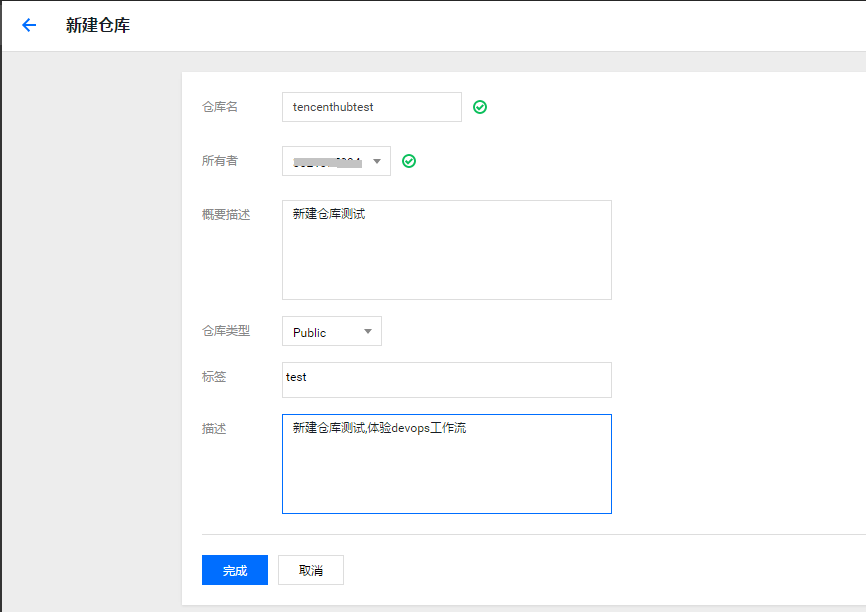

# <a name="tutorial-deploy-and-use-azure-container-registry"></a> 部署和使用腾讯云容器仓库

腾讯云 容器仓库 是用于 Docker 容器映像的基于腾讯云 的专用仓库。 可以通过专用容器仓库 安全地生成和部署应用程序和自定义代码。  介绍如何部署 Tencent Hub 实例并向其推送容器映像。 学习如何：

> [!div class="checklist"]
> * 创建 腾讯云 容器仓库 (Tencent hub) 实例
> * 标记 Tencent Hub 的容器映像
> * 向 Tencent Hub 上传映像
> * 查看仓库中的映像

在后续教程中，此 Tencent Hub 实例将与 TKE 中的 Kubernetes 群集集成，而应用程序则通过映像进行部署。

## <a name="before-you-begin"></a>开始之前

在上一教程中，已经为一个 腾讯云投票 应用程序示例创建了容器映像。 如果尚未创建 腾讯云投票 应用映像，请返回到上个教程学习。

本教程参考的是腾讯云的官方文档 [Tencent Hub新手入门](https://cloud.tencent.com/document/product/857/17143)。


## <a name="create-an-qcloud-container-registry"></a>创建腾讯云 容器仓库


填写仓库信息。根据业务填写相关信息，所有者可选择自己的账号或者所在的组织。仓库类型可选择 public 共有型或者 private 私有型。填写后单击【完成】。



首次使用镜像仓库的用户，需要先开通镜像仓库。

 - 命名空间：命名空间是您创建的私人镜像地址的前缀。
 - 用户名：默认是当前用户的账号，是您登录到腾讯云docker镜像仓库的身份。
 - 密码：是您登录到腾讯云Tencent Hub镜像仓库的凭证。

 
## <a name="log-in-to-the-container-registry"></a>登录到容器仓库

若要使用 Tencent Hub 实例，必须先登录。 使用 docker 的命令[docker-login]并提供一个唯一名称，该名称是在上一步提供给容器仓库的。

```docker cli
docker login --username=[username] hub.tencentyun.com
```

完成后，该命令会返回“登录成功”消息。

## <a name="tag-a-container-image"></a>标记容器映像

若要查看当前的本地映像的列表，请使用 [docker images][docker-images] 命令：

```
$ docker images

REPOSITORY                                                 TAG                      IMAGE ID            CREATED             SIZE
qcloud-vote-front                                          latest                   f4ac531bb890        About an hour ago   946MB
redis                                                      latest                   415381a6cb81        6 days ago          94.9MB
tiangolo/uwsgi-nginx-flask                                 python3.6                70971ba9bd6c        3 weeks ago         945MB
```

若要将 *qcloud-vote-front* 容器映像与 TencentHub 配合使用，需使用注册表的登录服务器地址对映像进行标记。qcloud-vote-front 就是我再Tencent Hub上创建的一个项目仓库，在将容器映像推送到容器仓库时，使用此标记进行路由。


```console
docker tag qcloud-vote-front hub.tencentyun.com/geffzhang/qcloud-vote-front:v1
```

若要验证是否已应用标记，请再次运行 [docker images][docker-images]。 系统会使用 Tencent Hub 实例地址和版本号对映像进行标记。

```
$ docker images

REPOSITORY                                                 TAG                      IMAGE ID            CREATED             SIZE
hub.tencentyun.com/geffzhang/qcloud-vote-front      v1                       f4ac531bb890        About an hour ago   946MB
qcloud-vote-front                                          latest                   f4ac531bb890        About an hour ago   946MB
redis                                                      latest                   415381a6cb81        6 days ago          94.9MB
tiangolo/uwsgi-nginx-flask                                 python3.6                70971ba9bd6c        3 weeks ago         945MB
```

## <a name="push-images-to-registry"></a>将映像推送到容器仓库

现在可以将 *qcloud-vote-front* 映像推送到 Tencent hub 实例。 使用 [docker push][docker-push] 并提供你自己的适用于映像名称的 *hub.tencentyun.com/geffzhang/qcloud-vote-front* 地址，如下所示：

```console
docker push hub.tencentyun.com/geffzhang/qcloud-vote-front:v1
```

可能需要数分钟才能将映像推送到 Tencent Hub

 

<!-- LINKS - external -->
[docker-login]: https://docs.docker.com/engine/reference/commandline/login/
[docker-images]: https://docs.docker.com/engine/reference/commandline/images/
[docker-push]: https://docs.docker.com/engine/reference/commandline/push/
